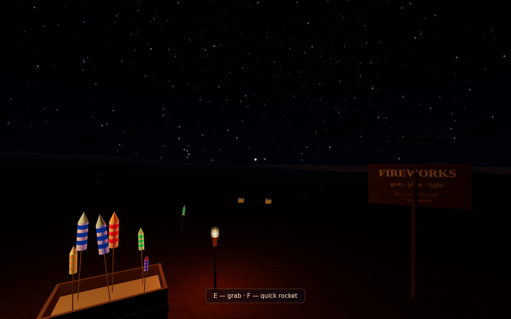
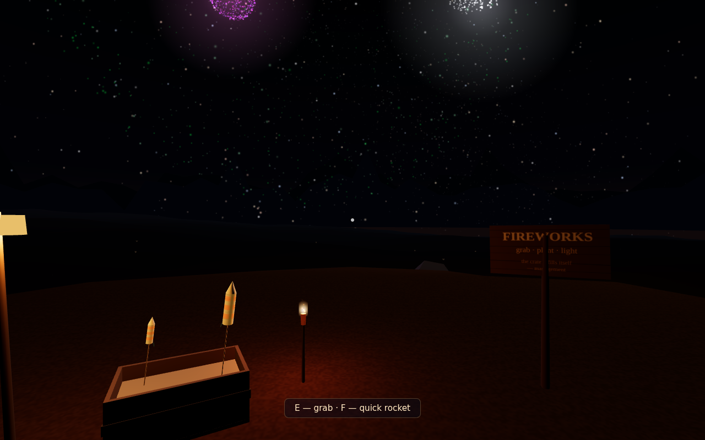
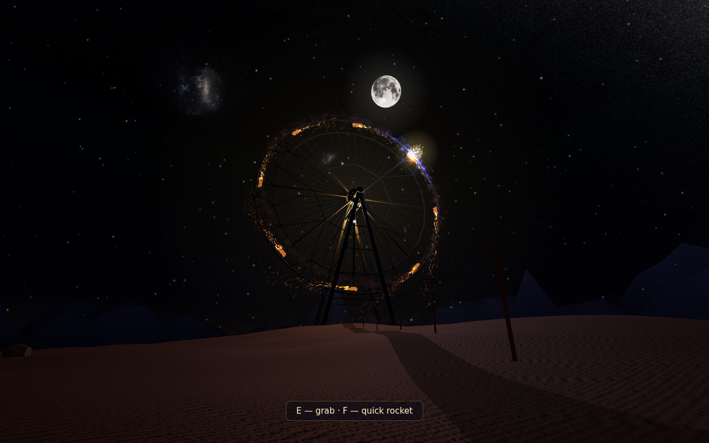

# Desert Fireworks VR 🎆

A WebXR fireworks sandbox for **Meta Quest** (built and tuned for Quest 3). You're alone in a
wide-open desert at night — moonlit dunes, a huge starfield, distant mesas — with a supply
crate that never runs out of fireworks, and a burning torch.

Grab a rocket. Push its stick into the sand at whatever angle you like. Touch the torch
flame to the fuse. Step back.




## What's in the crate

| Item | What it does |
| --- | --- |
| **Bottle Rocket** | small, quick, snappy pop — sometimes a little ghost shell that changes color mid-air |
| **Sky Rocket** | the classic — peony, dahlia, ring, Saturn (core + orbiting ring), willow, crossette, ghost… |
| **Mammoth Rocket** | huge multi-break shells, palm bursts, kamuro crowns, drooping horsetails, serious bass |
| **Grand Shell Rocket** | high, slow-opening display shells — gold kamuro, time-rain (glitter that keeps popping after the stars die), falling leaves, ghost relays |
| **Desert Bloom Fountain** | 10 seconds of color-shifting sparks and hiss |
| **Roman Candle** | 8 comets — you can hold this one while it fires and aim it |
| **Finale Cake** | 16-shot barrage with brocade crowns, serpent stars, and a triple-break finale |
| **Firecracker Belt** | a three-foot braided belt of 96 crackers — ships as a flat scarlet roll, dangles from wherever you grab it, and once the fuse catches it rips end-to-end (RRRAHTAHTAHTAH), jumping and writhing and shredding red paper everywhere. Light it and *throw* it |

Every shell picks a random effect and color palette, so no two are the same. The crate
quietly restocks itself.

## The detonator

Off to the right of camp sits a wooden **TNT plunger box** — hazard chevrons, blinking
armed lamp, red wire snaking away over the dunes. Grab the T-handle and shove it all the
way down (desktop: just click it). A spark races along the wire to a buried mortar
battery and a choreographed **two-minute grand finale** fills the sky: an opening gold
**kamuro crown**, color chases (the return lap is all **ghost shells** that change color
in mid-air), a hushed interlude of willows, horsetails and eerie falling leaves,
**niagara waterfall curtains** — lines of horsetail shells breaking in unison so their
striated silver trails pour down the sky in sheets, frying-metal sizzle and all — a
gold **time-rain** whose glitter keeps popping long after the stars die, then an
escalating barrage and a salute chain to close. The handle springs back up when the
desert goes quiet, ready to go again.

## The Colossus



Look west-northwest from camp — past the telegraph poles marching down the old
service track — and there it is: **a grand fire-wheel on the scale of the London
Eye**. A hundred and four meters of segmented lattice rim on a 68 m hub, A-frame
legs, stay cables, eight car-sized rocket-driver pods, and two rings of gas
lamps that wheel slowly against the stars. It runs its own program all night:
the banks catch pair by pair with distant *whoomphs*, half a minute of shuddering
take-up as the drive fights a hundred tons of inertia, then glory — and through
glory the drivers keep throttling up, so it **never stops accelerating**: from a
stately revolution every twenty seconds it winds all the way to a rev every five,
the rim ripping past at 70 m/s, combed arcs of fire smearing into a full hoop of
light, the dunes around its feet washed in whatever color it's burning, salutes
cracking off the top of the arc. When the drivers die it freewheels in the dark
for minutes, embers cooling on the pods.

It's built to *feel* far and huge rather than just be large in world units:
real distance (280 m — walking around camp barely moves it against the sky),
its own gunpowder plume and dust bank to haze the far rim, a light-pollution
halo, human-scale reference at its foot (a keeper's shed with one lit window),
and true speed-of-sound audio — **from camp, a salute flashes a full beat
before the boom arrives**. Walk the quarter mile and the roar turns from a
bass mountain into a ripping furnace, the bearings groan under the load, and
you have to crane your neck to find the top.

Don't fancy the walk? A **glowing brass pull-ring** hangs under the trailhead
sign — grab it (VR) or click it (desktop) and it whisks you out to stand at
the wheel's feet in a flash of gold sparks, facing straight up at the arc. A
waypost out there brings you home to camp the same way. And if you arrive to
find the wheel burnt out and freewheeling in the dark, the **keeper's firing
box** sits right by the landing spot, wired to the near leg: plunge it and
the whole program kindles over again, bank by bank. It re-arms itself
whenever the Colossus can take a light.

## Play it

### On the Quest (the real thing)

The game is a static web page — WebXR needs a **secure (HTTPS) origin**, so either:

1. **GitHub Pages** (easiest): enable Pages for this repo (Settings → Pages → Source:
   GitHub Actions; the included workflow deploys on every push to `main`). Then open the
   Pages URL in the Quest browser and press **Enter VR**.
2. **Local network**: on a computer on the same Wi-Fi, run

   ```sh
   npm run start:https
   ```

   and open the printed `https://<your-lan-ip>:8443` URL in the Quest browser
   (accept the self-signed-certificate warning once).

**Controls (VR)**

- **Grip** (or trigger) — grab a firework / the torch; grab with the other hand to pass
- **Release near the sand** — plants it at exactly the angle you're holding it (a green ring shows when planting is possible)
- **Torch flame → fuse** — lights it; the fuse sputters for a couple of seconds, so *step back*
- **Left stick** — walk · **Right stick** — snap turn
- Booms thump both controllers, scaled by how close you (unwisely) stood

### On a desktop browser

Run `npm start` and open <http://localhost:8080> (no HTTPS needed without a headset), or use the Pages URL.
**WASD + mouse** to move, **E** to grab/drop, **scroll** to tilt a held firework, **click** to
plant it / to light a fuse while holding the torch, **F** to cheat a lit rocket into existence.

There's also a self-running fireworks show at `?demo=1` if you just want to watch.

## The sound

Almost every sound — the fuse sputter, the launch *thoomp*, the swoosh, and above all
the booms — is **synthesized from first principles** at load time (see
[`src/synth.js`](src/synth.js)). The one exception: two tiny CC0 explosion recordings
(`assets/sounds/`) supply the dense chaotic texture that synthesis can't fake — the
booms use them as their body, and the launch swoosh **granulates them** (short
Hann-windowed grains, pitched up, overlap-added) into its turbulence bed.

- a boom is a Friedlander blast pulse + its ground bounce, the recorded body tilted
  dark by air absorption, an LF chest-thump pulse, and a long rolling brown-noise rumble;
- the launch swoosh peaks in ~15 ms (a real motor comes up to pressure instantly),
  then amplitude and brightness recede together as the rocket leaves — ignition spit,
  granulated turbulence, collapsing-lowpass hiss, pad rumble and propellant sizzle;
- crackle tails are a decaying Poisson rain of tiny shaped-noise snaps;
- the firecracker belt is a modulated Poisson storm tuned against measured
  firecracker-roll acoustics (~18-25 pops/s with near-simultaneous "brrr" clusters and
  momentary lulls, every cracker a different loudness): each pop is a tiny Friedlander
  N-wave + bright noise crack + LF thump + inverted ground bounce, over a rolling roar
  gated by pop density — with lone accent crackers played live at the moving burn front
  so the rattle travels in 3D;
- the waterfall curtains hang on a molten-sizzle loop: frying-hiss, dense micro-crackle
  and a soft mid roar, darkened by distance;
- everything plays through HRTF panners with **true speed-of-sound delay**
  (a shell bursting 150 m up arrives ~0.4 s after the flash) plus a synthesized
  "open desert with distant rock faces" impulse response in a shared convolver.

Several seeded variants of each sample plus randomized playback rate mean no two shots
sound identical. Headphones (or the Quest's speakers, up loud) strongly recommended.
To audition any recipe without a headset: `node tools/render-sounds.mjs out whoosh`.

## Tech notes

- Plain ES modules + [three.js](https://threejs.org) (vendored in `lib/`, pinned via npm) — no build step; the repo *is* the site.
- Explosions run on a stateless GPU particle pool (~96k particles): the CPU writes spawn
  data once and the vertex shader integrates drag + gravity ballistics analytically every
  frame (`src/particles.js`) — Quest-friendly.
- The pool renders everything in **one draw call** through a sprite atlas of real
  particle textures (Kenney Particle Pack, CC0 — smoke puffs, 4/6-point star sparkles,
  a crackle branch, an anamorphic flare): stars are **velocity-stretched** along their
  screen-space motion like a long-exposure photograph; premultiplied-alpha blending
  keeps stars additive while gunpowder smoke actually *occludes* the sky behind it;
  smoke is lit by the moon, the basin-wide burst wash, and the strongest live flash —
  so every shell illuminates its own smoke from inside, and old smoke blooms when the
  next shell breaks beside it. Relay ("ghost") stars carry a second composition color
  and switch mid-fall with an ignition pop, like the real two-stage stars.
- Terrain is an analytic dune heightfield (`src/terrain.js`), so planting, walking, item
  drops and rocket ground-hits all sample the exact same function.
- Lighting is full PBR: a tiny procedural equirect night sky on `scene.environment`
  gives every surface a moonlit sheen (glossy wrappers, metallic nose cones, brass
  lantern), the moon throws real PCF shadows from a tight ortho box over the campsite
  (`?shadows=0` to opt out), and the sand carries a tiling ripple normal map plus a
  view-dependent glitter term injected into the standard shader — head sway makes the
  dunes sparkle, and burst light makes them shimmer.
- Burst flash lights are pooled `PointLight`s that paint the dunes with the shell's
  color (fountain lights are pooled too — changing the scene's light count mid-show
  forces a shader recompile hitch on Quest, so the light count never changes).
- The Colossus (`src/colossus.js`) is ~26 draw calls and ~12k triangles: every truss
  member is an instanced bar, the marker lamps are two shader-driven point clouds,
  and its fires ride the shared particle pool. Its spin integrates drive torque
  against quadratic aero drag — with a throttle that winds up 16-fold across the
  glory phase — so spin-up takes half a minute, the top speed takes most of a
  minute more, and coast-down takes minutes. One permanent extra `PointLight` carries its glow, its roar/groans are
  synthesized like everything else (`renderColossusLoop`, `renderGroan`), and a
  steady fire-light slot in the particle shader lets it light its own smoke plume.
- `tools/screenshot.mjs` is a headless QA harness (Playwright + SwiftShader) that loads
  the demo, verifies zero console errors, and captures screenshots.

## Development

```sh
npm install        # dev deps only (three for vendoring, playwright-core for QA)
npm start          # http://localhost:8080
node tools/screenshot.mjs shots   # headless smoke test + screenshots
```

MIT licensed. Nearly all art and audio are procedural; the exceptions are credited in
[`assets/textures/README.md`](assets/textures/README.md) (sky and moon imagery, and the
CC0 Kenney particle sprites the fireworks are drawn with) and
[`assets/sounds/LICENSE.txt`](assets/sounds/LICENSE.txt) (two CC0 explosion recordings).
